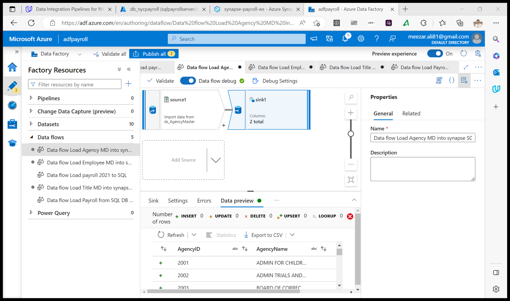

# Data-Integration-Pipelines-for-NYC-Payroll-Data-Analytics

### The City of New York would like to develop a Data Analytics platform on Azure Synapse Analytics to accomplish two primary objectives:

Analyze how the City's financial resources are allocated and how much of the City's budget is being devoted to overtime.
Make the data available to the interested public to show how the City’s budget is being spent on salary and overtime pay for all municipal employees.
You have been hired as a Data Engineer to create high-quality data pipelines that are dynamic, can be automated, and monitored for efficient operation. The project team also includes the city’s quality assurance experts who will test the pipelines to find any errors and improve overall data quality.

The source data resides in Azure Data Lake and needs to be processed in a NYC data warehouse in Azure Synapse Analytics. The source datasets consist of CSV files with Employee master data and monthly payroll data entered by various City agencies.

## Step 1: Prepare the Data Infrastructure
### Create the data lake and upload data
### Create an Azure Data Factory Resource
### Create a SQL Database to store the current year of the payroll data
### Create A Synapse Analytics workspace, or use one you already have created.

## Step 2: Create Linked Services
### Create a Linked Service for Azure Data Lake
### Create a Linked Service to SQL Database that has the current (2021) data
### Create a Linked Service for Synapse Analytics

## Step 3: Create Datasets in Azure Data Factory.
### Create the datasets for the AgencyMaster on Azure Data Lake Gen2

### Create the datasets for the EmpMaster on Azure Data Lake Gen2

### Create the datasets for the TitleMaster on Azure Data Lake Gen2

### Create the datasets for the 2021 Payroll file on Azure Data Lake Gen2

###  Create the datasets for destination (target) tables in Synapse Analytics

## Step 4: Create Data Flows

### create the data flow to load 2021 Payroll Data to SQL DB transaction table

### Create Pipeline to load 2021 Payroll data into transaction table in the SQL DB

### Create data flows to load the data from the data lake files into the Synapse Analytics data tables

### Create a data flow to load 2021 data from SQL DB to Synapse Analytics

### Create pipelines for Employee, Title, Agency, and year 2021 Payroll transaction data to Synapse Analytics containing the data flows.

## Step 5: Data Aggregation and Parameterization

### Create a Summary table in Synapse with the following SQL script and create a dataset named table_synapse_nycpayroll_summary
integration1

### Create a new dataset for the Azure Data Lake Gen2 folder that contains the historical files

### Create new data flow and name it Dataflow Aggregate Data

### Create a new Pipeline and add the Aggregate data flow

